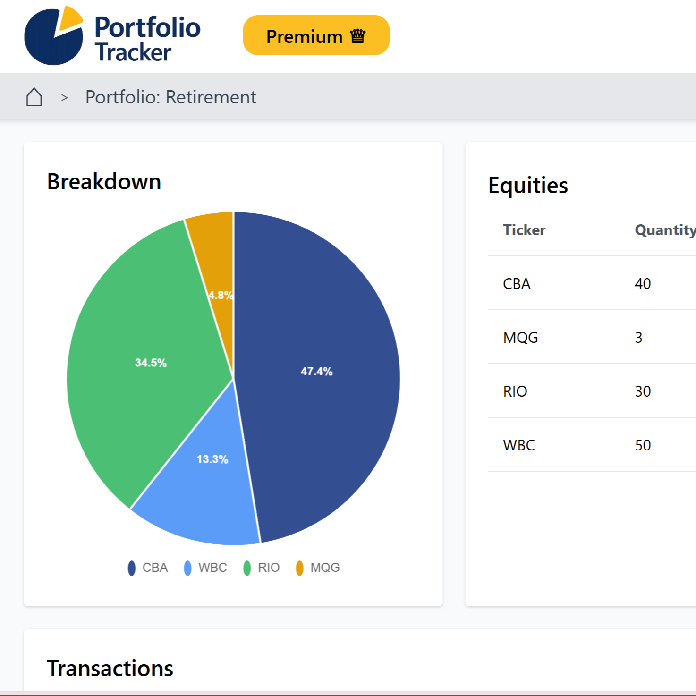

# Equity Portfolio Tracker

A full-stack web application for Australian retail investors to manage ASX portfolios, record trades, monitor performance, and estimate Australian capital gains tax.

This project was developed by a six-person team for **UNSW COMP3900 Computer Science Project (2026 T1)**. This public repository is a portfolio copy of the final team submission. The contribution section below distinguishes my individual work from the overall team product.



## My Contributions — Steven Sy Shi

I worked primarily as a **backend developer**, with additional responsibility for the initial project infrastructure. The original repository contains **115 commits associated with my GitHub account or UNSW commit identity, including 95 non-merge commits**, between 23 February and 26 April 2026.

My main contributions were:

- **Project and development infrastructure**
  - Created the initial Django backend structure and Python dependency setup.
  - Configured PostgreSQL, Dockerfile, Docker Compose, database environment variables, and backend setup documentation.
  - Fixed cross-platform Docker shell-script line-ending issues.

- **Transactions and validation**
  - Designed the initial transaction model, migrations, Django admin registration, routes, and transaction-creation backend.
  - Implemented manual transaction validation and CSV transaction import with row-level error handling.
  - Connected transactions to selected portfolios and equity records.
  - Added validation for holdings, sell quantities, trade-date ordering, and future-dated transactions.

- **Portfolio and holding logic**
  - Implemented portfolio and equity models plus portfolio creation and selection routes.
  - Built FIFO lot matching using remaining quantities and transaction-match records.
  - Integrated FIFO updates into both manual and CSV transaction flows.
  - Implemented backend portfolio performance calculations and corrected realised-profit percentage calculations.
  - Added the flow for transferring an equity holding between portfolios, including validation and holding reconstruction.

- **Exports and Australian CGT**
  - Implemented CSV export for transaction history and portfolio holdings.
  - Refactored capital-gains calculations into reusable helpers and implemented CGT CSV export.

- **Market-data operations and administration**
  - Added price-update logging to the Yahoo Finance update flow.
  - Added Django admin search and filters for price-update logs.

These contribution claims were derived from the original repository's commit history associated with GitHub account **[@stevenyyy999](https://github.com/stevenyyy999)** and Steven's linked UNSW commit identity.

## Team Product

The completed application supports:

- Account registration, email verification, login, and Google OAuth
- Multiple ASX investment portfolios
- Manual trade entry and CSV import
- FIFO matching for BUY and SELL transactions
- Realised and unrealised performance calculations
- Historical prices and charts powered by Yahoo Finance data
- Portfolio and equity breakdowns
- Australian financial-year CGT estimates, including the 50% discount for eligible holdings
- Transaction, holding, and CGT CSV exports
- Currency display conversion
- Stripe-backed free and premium membership plans
- Django administration and price-update logs

## Tech Stack

| Area | Technology |
|---|---|
| Backend and server-rendered UI | Python, Django |
| Database | PostgreSQL |
| Market data | yfinance / Yahoo Finance |
| Payments | Stripe |
| Authentication | Django Allauth, Google OAuth |
| Styling | HTML, Tailwind CSS, JavaScript |
| Development | Docker, Docker Compose |
| Testing and quality | Django TestCase, coverage, Ruff, GitHub Actions |

## Project Structure

- `equity_tracker/config/` — Django settings and application configuration
- `equity_tracker/core/` — landing page, dashboard, shared views, and templates
- `equity_tracker/transactions/` — transaction entry, CSV import, validation, history, and FIFO helpers
- `equity_tracker/portfolios/` — portfolios, holdings, performance, prices, and equity transfers
- `equity_tracker/taxCalculator/` — Australian CGT calculations and exports
- `equity_tracker/subscriptions/` — Stripe subscriptions and webhooks
- `equity_tracker/users/` — accounts and profiles
- `equity_tracker/currency/` — exchange-rate support

## Run Locally with Docker

Requirements: Docker Desktop and Docker Compose.

```bash
cd equity_tracker
cp .env.example .env
docker compose up --build
```

Open <http://localhost:8000/>. Create an administrator with:

```bash
docker compose exec web python manage.py createsuperuser
```

## Environment Variables

The application reads secrets from `equity_tracker/.env`. Do not commit that file.

```dotenv
DJANGO_SECRET_KEY=replace-with-a-random-local-secret
GOOGLE_CLIENT_ID=
GOOGLE_CLIENT_SECRET=
STRIPE_SECRET_KEY=
STRIPE_WEBHOOK_SECRET=
STRIPE_PUBLISHABLE_KEY=
STRIPE_PREMIUM_PRICE_ID=
STRIPE_ENDPOINT_SECRET=
EXCHANGE_RATE_API_KEY=
MAIL=
MAIL_PASS=
```

Without optional credentials, the core portfolio features can still run locally, while the related integration may be unavailable.

## Tests and Quality Checks

```bash
cd equity_tracker
docker compose exec web python manage.py test
docker compose exec web bash scripts/run_coverage.sh
ruff check .
ruff format --check .
```

## Security Note

The original classroom snapshot contained a hard-coded Django development key. This public portfolio copy replaces it with the `DJANGO_SECRET_KEY` environment variable and a clearly non-production local fallback. No Stripe, Google, email, or exchange-rate credentials are included.

## Attribution

This is a team-built academic project. Features not listed under **My Contributions** should be understood as collaborative work or work led by other team members. The repository is published to demonstrate the resulting software and my verified engineering contributions.
